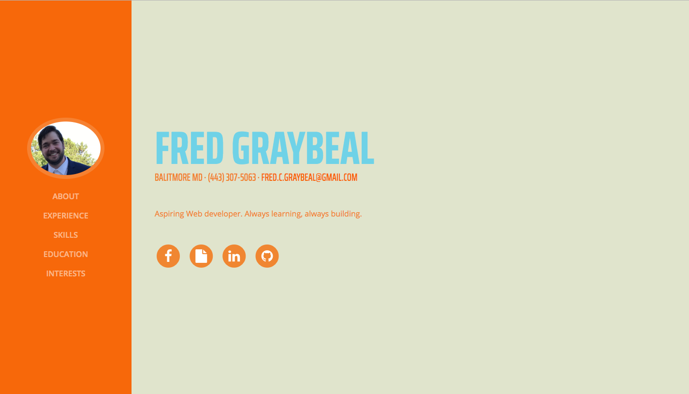

# my-portfolio

> A Vue.js project I built following a short guide.

## Credit
* Based on this post: https://codeburst.io/how-i-created-seo-friendly-portfolio-cv-website-and-hosted-it-on-github-d5c4da43cf2f

* Uses this bootstrap template: https://github.com/BlackrockDigital/startbootstrap-resume

* colour palette inspitation: https://www.colourlovers.com/palette/92095/Giant_Goldfish

## Portfolio Screenshot



## Build Setup

``` bash
# install dependencies
npm install

# serve with hot reload at localhost:8080
npm run dev

# build for production with minification
npm run build

# build for production and view the bundle analyzer report
npm run build --report
```

For a detailed explanation on how things work, check out the [guide](http://vuejs-templates.github.io/webpack/) and [docs for vue-loader](http://vuejs.github.io/vue-loader).
